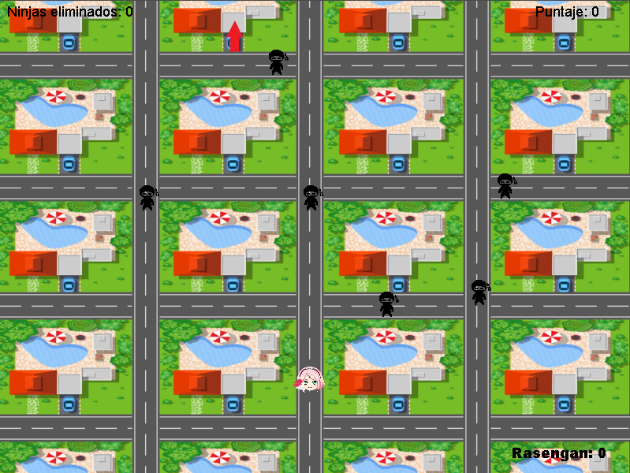

# Naruto Delivery Challenge

## Descripción

Naruto Delivery Challenge es un emocionante juego desarrollado en Java, basado en el famoso anime "Naruto". En este juego, el jugador asume el papel de la kunoichi  Sakura Haruno, quien se ha convertido en una mensajera ninja. El objetivo del juego es realizar entregas en distintos puntos del mapa, esquivando obstáculos que son representados por otros ninjas que intentarán detener a Sakura en su misión.

## Características principales

- **Entregas Ninja:** Sakura debe llevar a cabo entregas en diferentes puntos del mapa para completar su misión. Cada entrega completada con éxito le otorga puntos al jugador.

- **Esquiva de Ninjas:** En su camino hacia los puntos de entrega, Naruto se encontrará con otros ninjas que intentarán detenerlo. El jugador debe esquivar a estos ninjas para evitar que lo capturen.

- **Poder Especial - Rasengan:** Sakura cuenta con un poder especial llamado Rasengan, que puede utilizar para eliminar a los ninjas enemigos en su camino. Sin embargo, el Rasengan tiene un tiempo de enfriamiento (cooldown), por lo que el jugador debe usarlo con estrategia.

- **Objetivo Final:** El objetivo final del juego es completar todas las entregas de manera exitosa, evitando ser capturado por los ninjas enemigos. Si el jugador logra realizar todas las entregas, ¡ganará el juego!

## Capturas de pantalla

## Instalación

1. Clona este repositorio en tu máquina local utilizando el siguiente comando: git clone https://github.com/ImLevan/Juego-Ninjas.git

2. Abre el proyecto en tu IDE de Java preferido.

3. Compila y ejecuta el juego.

## Requisitos del Sistema

- Java
- JDK 8 o superior.
- IDE de Java

## Cómo jugar

- Utiliza las teclas "w a s d" para mover a Sakura por el mapa.

- Presiona la tecla "Espacio" para utilizar el poder especial Rasengan y eliminar a los ninjas enemigos.

- Esquiva a los ninjas enemigos y lleva a cabo todas las entregas para ganar el juego.

---

¡Esperamos que disfrutes jugando "Naruto Delivery Challenge" tanto como nosotros disfrutamos creándolo! Si tienes alguna pregunta o sugerencia, no dudes en contactarnos.

¡Que comience la aventura ninja! 🍥🍜🔥

